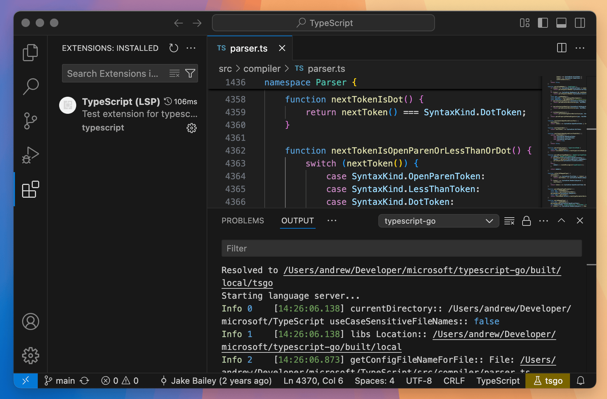

# TypeScript 7

[Not sure what this is? Read the announcement post!](https://devblogs.microsoft.com/typescript/typescript-native-port/)

This repo is very much under active development; as such, there are no published artifacts at this time.
Interested developers can clone the repo and run it locally to try things out as they become available.

## How to Build and Run

This repo uses [Go 1.24 or higher](https://go.dev/dl/), [Node.js with npm](https://nodejs.org/), and [`hereby`](https://www.npmjs.com/package/hereby).

For tests and code generation, this repo contains a Git submodule referencing the main TypeScript repo at the commit being ported.
When cloning, you should clone with submodules:

```console
$ git clone --recurse-submodules https://github.com/microsoft/typescript-go.git
```

If you have already cloned the repo, you can initialize the submodule with:

```console
$ git submodule update --init --recursive
```

With the submodule in place and after running `npm ci`, you can run tasks via `hereby`, similar to the TypeScript repo:

```console
$ hereby build          # Verify that the project builds
$ hereby test           # Run all tests
$ hereby install-tools  # Install additional tools such as linters
$ hereby lint           # Run all linters
$ hereby format         # Format all code
$ hereby generate       # Generate all Go code (e.g. diagnostics, committed to repo)
```

Additional tasks are a work in progress.

`hereby` is not required to work on the repo; the regular `go` tooling (e.g., `go build`, `go test ./...`) will work as expected.
`hereby` tasks are provided as a convenience for those familiar with the TypeScript repo.

### Running `tsgo`

After running `hereby build`, you can run `built/local/tsgo`, which behaves mostly the same as `tsc` (it respects `tsconfig`, but also prints out performance stats).
This is mainly a testing entry point; for higher fidelity with regular `tsc`, run `tsgo tsc [flags]`, which behaves more similarly to `tsc`.

### Running LSP Prototype

To try the prototype LSP experience:

* Run VS Code in the repo workspace (`code .`)
* Copy `.vscode/launch.template.json` to `.vscode/launch.json`
* Press <kbd>F5</kbd> (or use `Debug: Start Debugging` from the command palette)

This will launch a new VS Code instance which uses the Corsa LS as the backend. If everything is correctly set up, you should see "typescript-go" as an option in the Output pane:



## What Works So Far?

This is still a work in progress and is not yet at full feature parity with TypeScript. Bugs may exist. Please check this list carefully before logging a new issue or assuming an intentional change.

Status overview:

 * Program creation (reads `lib`, `target`, `reference`, `import`, `files`, `include`, and `exclude`): **done**. You should see the *same files*, with modules resolved to the *same locations*, as in a TypeScript 5.8 (TS5.8) invocation.
   * Not all resolution modes are supported yet.
 * Parsing/scanning (reads source text and determines syntax shape): **done**. You should see the exact same *syntax errors* as in a TS5.8 invocation.
 * Command-line and `tsconfig.json` parsing: **mostly done**. Note that the entry point is slightly different (for now).
 * Type resolution (resolves computed types to a concrete internal representation): **done**. You should see the same types as in TS5.8.
 * Type checking (checks for problems in functions, classes, and statements): **done**. You should see the same errors, in the same locations, with the same messages, as in TS 5.8.
   * Type printback in errors may display slightly differently; this is in progress.
 * JavaScript-specific inference and JSDoc: **not ready**.
 * JSX: **not ready**.
 * Declaration emit: **not ready**. Coming soon!
 * Emit (JS output): **in progress**. `target: esnext` (minimal downleveling) is well-supported, but other targets may have gaps.
 * Watch mode: **prototype** (watches the correct files and rebuilds, but doesn't do incremental rechecking).
 * Build mode / project references: **not ready**.
 * Incremental build: **not ready**.
 * Language service (LSP): **prototype** only. Expect minimal functionality (errors, hover, go to definition). More features soon!
   * ASCII files only for now.
 * API: **not ready**.

Definitions:

 * **done** (aka "believed done"): We're not currently aware of any deficits or major remaining work to do. OK to log bugs.
 * **in progress**: Currently being worked on; some features may work and some might not. OK to log panics, but nothing else, please.
 * **prototype**: Proof of concept only; do not log bugs.
 * **not ready**: Either not started yet or far enough from ready that you shouldn't bother using it yet.

## Other Notes

Long-term, we expect that the contents of this repo will be merged into `microsoft/TypeScript`.
As a result, the repo and the issue tracker for typescript-go will eventually be closed, so please treat discussions/issues accordingly.

For a list of intentional changes with respect to TypeScript 5.7, see `CHANGES.md`.

## Contributing

This project welcomes contributions and suggestions. Most contributions require you to agree to a
Contributor License Agreement (CLA) declaring that you have the right to, and actually do, grant us
the rights to use your contribution. For details, visit [Contributor License Agreements](https://cla.opensource.microsoft.com).

When you submit a pull request, a CLA bot will automatically determine whether you need to provide
a CLA and decorate the PR appropriately (e.g., status check, comment). Simply follow the instructions
provided by the bot. You will only need to do this once across all repos using our CLA.

This project has adopted the [Microsoft Open Source Code of Conduct](https://opensource.microsoft.com/codeofconduct/).
For more information, see the [Code of Conduct FAQ](https://opensource.microsoft.com/codeofconduct/faq/) or
contact [opencode@microsoft.com](mailto:opencode@microsoft.com) with any additional questions or comments.

## Trademarks

This project may contain trademarks or logos for projects, products, or services. Authorized use of Microsoft
trademarks or logos is subject to and must follow
[Microsoft's Trademark & Brand Guidelines](https://www.microsoft.com/legal/intellectualproperty/trademarks/usage/general).
Use of Microsoft trademarks or logos in modified versions of this project must not cause confusion or imply Microsoft sponsorship.
Any use of third-party trademarks or logos is subject to those third parties' policies.
